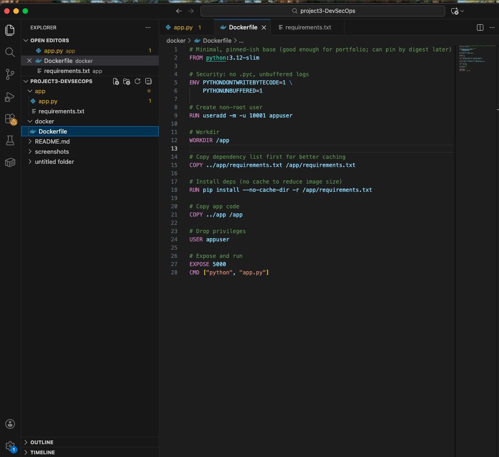
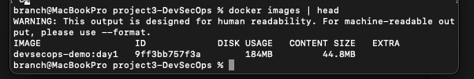
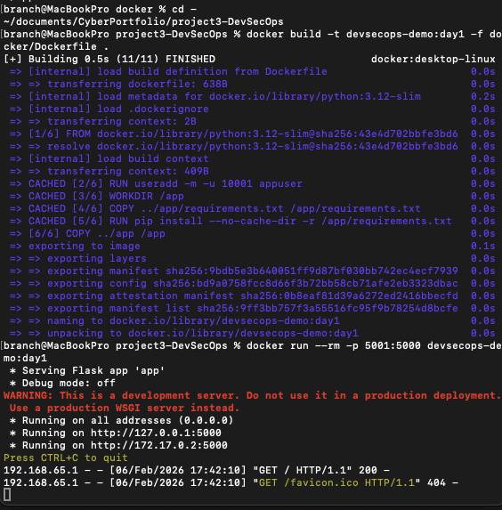
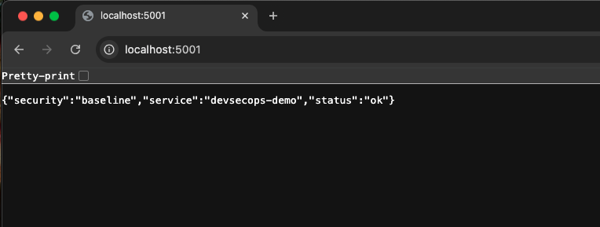

# Project 3 – DevSecOps Container Security  
## Day 1: Containerized Application Baseline

## Objective
Establish a clean, functional baseline by containerizing a simple Python web application using Docker. This day focuses on validating application structure, container build success, and runtime functionality before introducing security controls.

---

## Project Structure Validation

**Action:**  
Created a structured project layout separating application code, Docker configuration, and documentation artifacts.

**Purpose:**  
Ensure the project follows a clean, maintainable structure aligned with real-world DevSecOps workflows.

**Status:**  
Project directories are organized and ready for iterative security enhancements.

### Screenshot

---

## Docker Image Build Validation

**Action:**  
Built a Docker image using a minimal Python base image and a custom Dockerfile.

**Purpose:**  
Confirm that the application can be successfully packaged into a container image without errors.

**Status:**  
Docker image builds successfully with all dependencies installed.

### Screenshot

---

## Docker Image Listing Validation

**Action:**  
Listed locally available Docker images after build completion.

**Purpose:**  
Verify that the newly built image exists locally and is correctly tagged.

**Status:**  
Application image is present and available for container execution.

### Screenshot

---

## Container Runtime Validation

**Action:**  
Ran the container locally with port mapping enabled to expose the application.

**Purpose:**  
Validate that the container starts correctly and the application runs as expected at runtime.

**Status:**  
Container runs successfully and listens on the expected port.

### Screenshot

---

## Application Accessibility Validation

**Action:**  
Accessed the application via a web browser using the exposed container port.

**Purpose:**  
Confirm end-to-end functionality from container startup to user-facing application access.

**Status:**  
Application is accessible and responds correctly in the browser.

### Screenshot

---

## Security Notes

- Application is running as a baseline without security hardening
- No container scanning or policy enforcement applied yet
- Container build and runtime confirmed stable
- Baseline intentionally left unsecured for comparison in later days

---

## Outcome

Day 1 establishes a **working containerized application baseline**. The environment is stable, reproducible, and ready for incremental security enhancements including image scanning, least-privilege execution, secrets management, and CI-based enforcement in subsequent days.