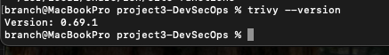
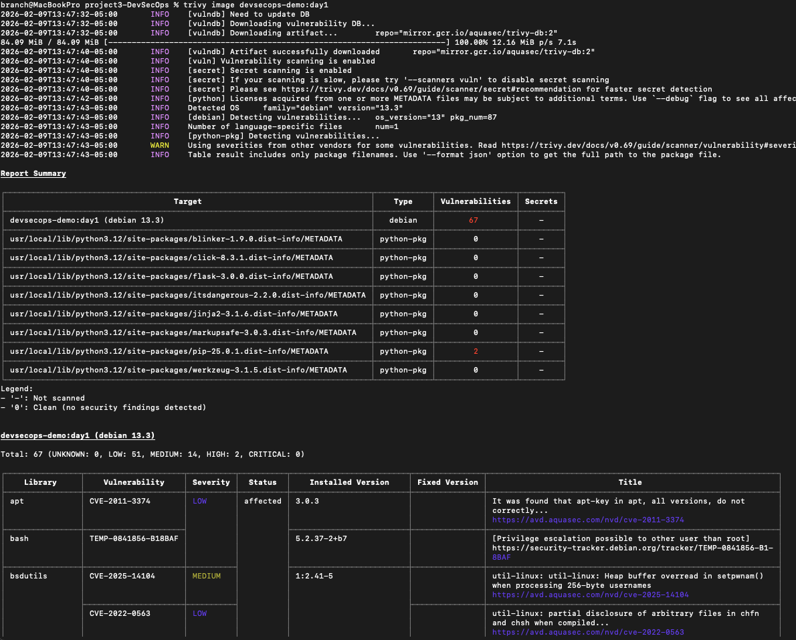
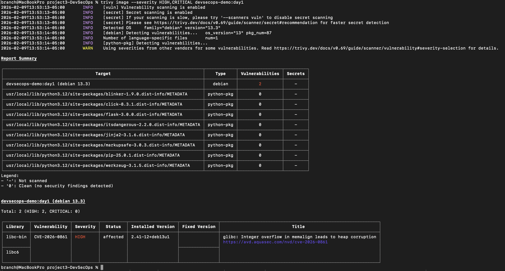

# Project 3 – DevSecOps
## Day 2: Container Image Vulnerability Scanning (Trivy)

## Objective
Introduce container security scanning by identifying known vulnerabilities in the Docker image built on Day 1. This validates image risk visibility early in the DevSecOps lifecycle.

---

## Step 1 — Verify Trivy Installation

**Action:**  
Verified that Trivy is installed and accessible from the host system.

**Purpose:**  
Ensure the vulnerability scanning tool is available before performing container image analysis.

**Status:**  
Trivy is installed and functioning correctly.

### Screenshot

---

## Step 2 — Scan Docker Image

**Action:**  
Executed a full Trivy scan against the Docker image created on Day 1.

**Purpose:**  
Identify known vulnerabilities present within the container image.

**Status:**  
Scan completed successfully and returned vulnerability results.

### Screenshot

---

## Step 3 — Filter High and Critical Vulnerabilities

**Action:**  
Re-ran the Trivy scan focusing on HIGH and CRITICAL severity vulnerabilities.

**Purpose:**  
Highlight the most impactful security risks that would require remediation in a production environment.

**Status:**  
High and Critical vulnerabilities were successfully identified.

### Screenshot

---

## Step 4 — Export Scan Results

**Action:**  
Saved the Trivy scan output to a text file in the project root.

**Purpose:**  
Preserve scan results for documentation, auditing, and future comparison.

**Status:**  
Scan output successfully saved.

### 
(trivy-report-day2.txt)