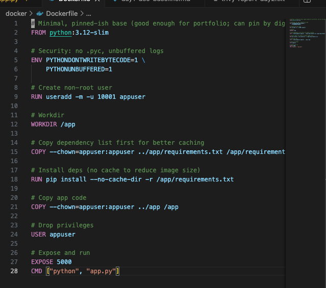
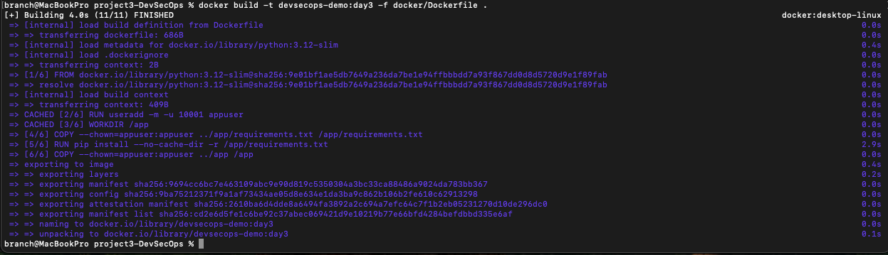
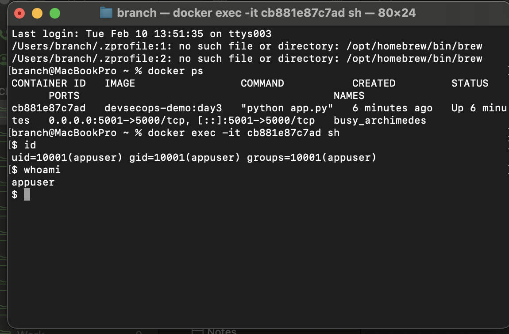
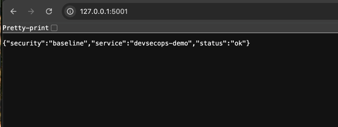

# Project 3 – DevSecOps Pipeline  
## Day 3: Non-root User & Least Privilege

## Objective
Harden the container runtime by enforcing **least privilege**. This day ensures the application runs as a **non-root** user inside the container, reducing the blast radius of container compromise and aligning with container security best practices.

---

## Non-root Container User Implementation

**Action:**  
Updated the Dockerfile to create and use a dedicated unprivileged container user (appuser) and ensure the application directory is owned by that user before runtime.

**Purpose:**  
Prevent the application from running as root inside the container and reduce risk of privilege escalation, filesystem tampering, and container breakout impact.

**Status:**  
Dockerfile is configured to run the container under a non-root user and enforce least-privilege execution.

### Screenshot

---

## Image Rebuild Validation

**Action:**  
Rebuilt the container image after applying non-root hardening changes to the Dockerfile.

**Purpose:**  
Ensure the updated security configuration is embedded into the build artifact and consistently reproducible.

**Status:**  
Image rebuild completed successfully with non-root configuration applied.

### Screenshot

---

## Non-root Runtime Validation

**Action:**  
Started the container and validated runtime identity by checking the effective user inside the container using `id` and `whoami`.

**Purpose:**  
Confirm the container is executing under a non-root identity (UID not 0), proving least-privilege enforcement at runtime.

**Status:**  
Container runs as a non-root user and does not execute with root privileges.

### Screenshot

---

## Application Availability Check

**Action:**  
Verified the application still loads and responds correctly after switching to a non-root runtime user.

**Purpose:**  
Ensure security hardening does not break application functionality and confirm the hardened container remains operational.

**Status:**  
Application remains accessible and functional under non-root execution.

### Screenshot

---

## Security Notes

- Container runtime is configured for least privilege (non-root execution)
- Application files are owned by the unprivileged user to prevent permission failures
- Reduces impact of container compromise and aligns with secure container deployment practices

---

## Outcome

Day 3 confirms that the containerized application runs under a **non-root user** with **least privilege** enforced. This improves baseline container security posture and prepares the project for secure secrets handling, logging, and CI-based security validation in later days.