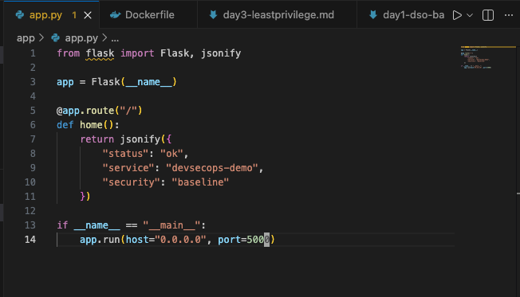
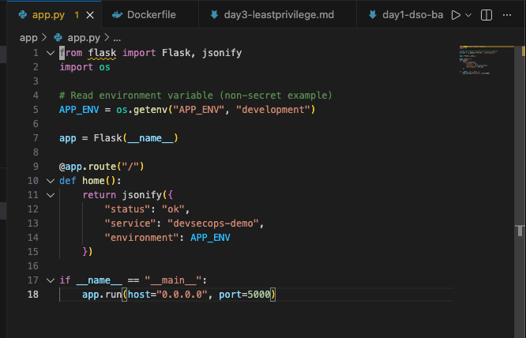
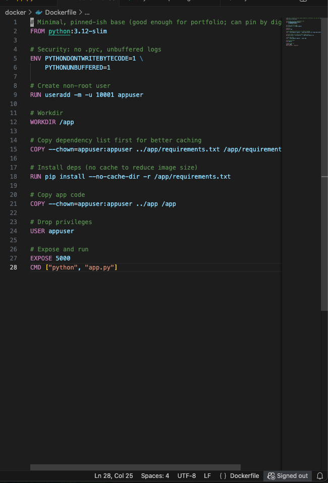
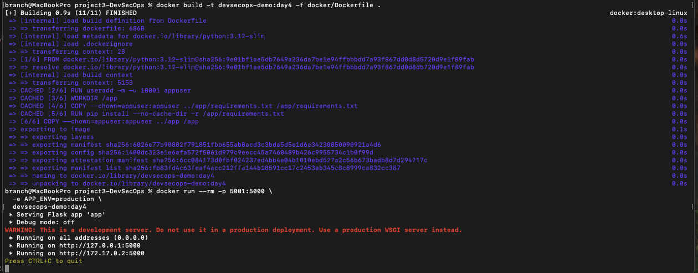
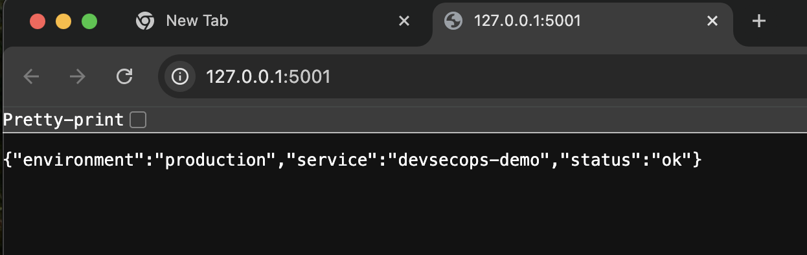

# Project 3 – DevSecOps Pipeline  
## Day 4: Secrets Handling (Environment Variables)

## Objective
Eliminate hardcoded configuration values and introduce **runtime configuration via environment variables**. This day focuses on secure secrets handling by ensuring sensitive or environment-specific values are injected at runtime rather than embedded in source code or container images.

---

## Application Code Review

**Action:**  
Reviewed the existing `app.py` file to identify any hardcoded secrets, credentials, or environment-specific configuration values.

**Purpose:**  
Ensure no sensitive data is committed directly into source code prior to implementing environment variable handling.

**Status:**  
No hardcoded secrets or sensitive values were found in the application code.

### Screenshot

---

## Environment Variable Implementation

**Action:**  
Updated the application to read configuration values from environment variables using safe default values.

**Purpose:**  
Enable secure runtime configuration without requiring source code changes between environments.

**Status:**  
Application successfully reads and applies environment variables at runtime.

### Screenshot

---

## Dockerfile Secrets Validation

**Action:**  
Reviewed the Dockerfile to confirm no secrets or environment-specific values are hardcoded into the container image.

**Purpose:**  
Prevent secrets from being baked into build artifacts and ensure portability across environments.

**Status:**  
Dockerfile contains no hardcoded secrets and supports runtime-only configuration.

### Screenshot

---

## Runtime Environment Variable Injection

**Action:**  
Started the container while injecting environment variables at runtime using Docker’s `-e` flags.

**Purpose:**  
Validate that configuration can be supplied securely at runtime without rebuilding the image.

**Status:**  
Container starts successfully and receives injected environment variables.

### Screenshot

---

## Application Runtime Confirmation

**Action:**  
Accessed the running application to verify that environment variables are correctly applied during execution.

**Purpose:**  
Confirm application functionality and configuration correctness after secrets handling changes.

**Status:**  
Application loads successfully and reflects runtime-injected environment configuration.

### Screenshot

---

## Security Notes

- No secrets stored in source code
- No secrets embedded in container images
- Configuration injected only at runtime
- Safe defaults prevent misconfiguration failures
- Aligns with container and 12-factor application security best practices

---

## Outcome

Day 4 confirms that the application securely handles configuration through **environment variables**, eliminating hardcoded secrets and improving deployment security. This establishes a secure foundation for logging, observability, and CI-based security validation in subsequent stages.