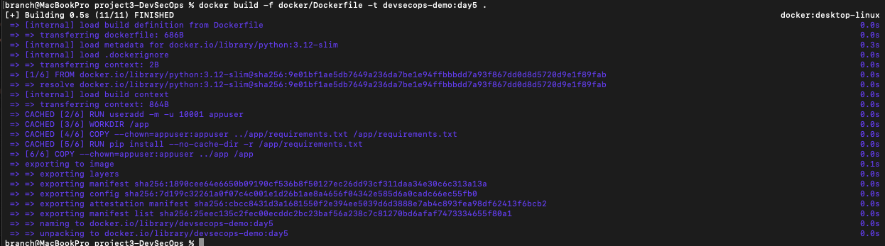
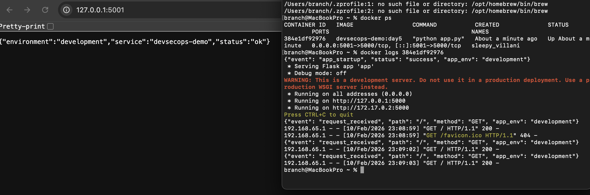
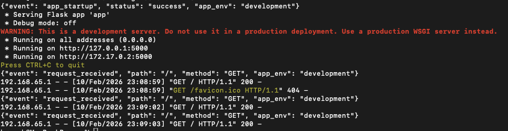

# Project 3 – DevSecOps Pipeline  
## Day 5: Logging & Observability (Structured Logs)

## Objective
Introduce **structured logging** and basic observability into the containerized application. This day focuses on emitting **JSON-formatted logs to stdout**, validating runtime visibility via Docker logs, and ensuring logging aligns with container and DevSecOps best practices.

---

## Structured Logging Implementation

**Action:**  
Updated the application to initialize Python logging and emit structured JSON log events for application startup and request handling.

**Purpose:**  
Ensure logs are machine-readable, consistent, and suitable for aggregation by centralized logging and monitoring platforms.

**Status:**  
Application emits structured JSON logs to stdout using a consistent schema.

### Screenshot

---

## Runtime Log Emission (JSON Format)

**Action:**  
Started the container and observed log output using the Docker runtime logging mechanism.

**Purpose:**  
Validate that logs are written to stdout/stderr rather than files and are accessible using standard container tooling.

**Status:**  
Structured JSON logs are successfully emitted and visible via `docker logs`.

### Screenshot

---

## Log Validation & Runtime Confirmation

**Action:**  
Generated application traffic and confirmed that request events, environment context, and startup events appear correctly in the logs.

**Purpose:**  
Ensure logging captures meaningful runtime signals required for debugging, monitoring, and incident response.

**Status:**  
Logs correctly reflect application lifecycle events and request activity.

### Screenshot

---

## Security & Observability Notes

- Logs are emitted to stdout (container logging best practice)
- JSON structure enables SIEM and log aggregation compatibility
- No sensitive values are logged
- Logging does not impact application availability
- Provides operational visibility for future CI and monitoring stages

---

## Outcome

Day 5 establishes **structured, runtime-accessible logging** for the containerized application. This improves observability, supports incident response workflows, and prepares the project for **CI-based security scanning and automated validation** in Day 6.