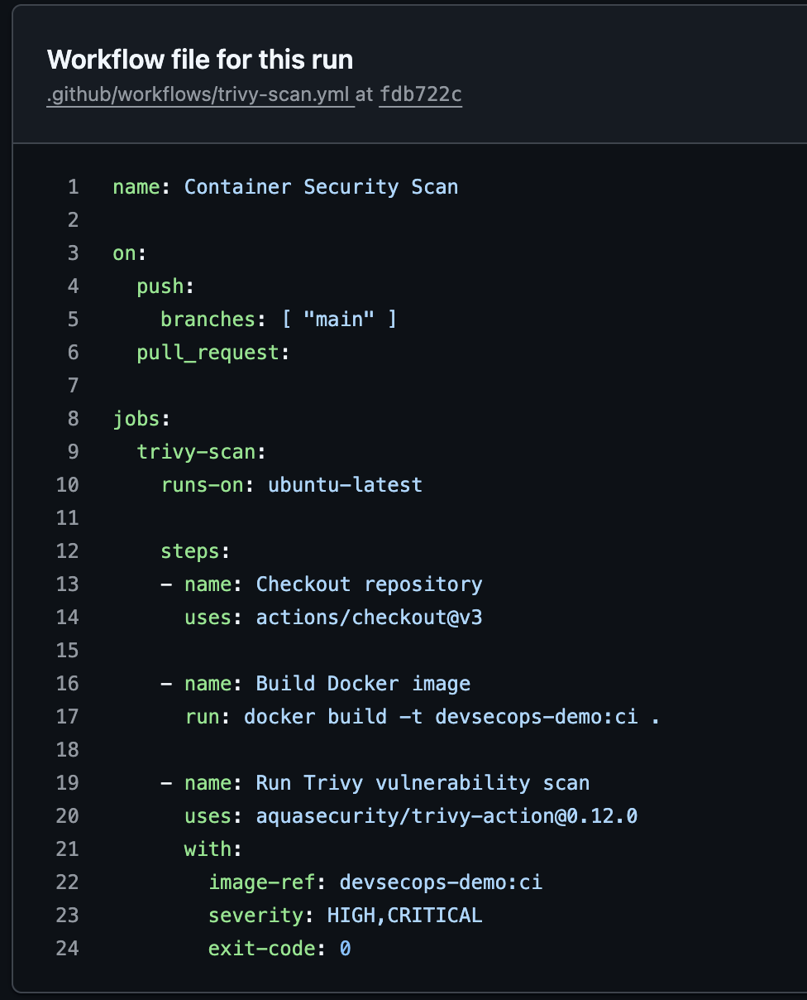
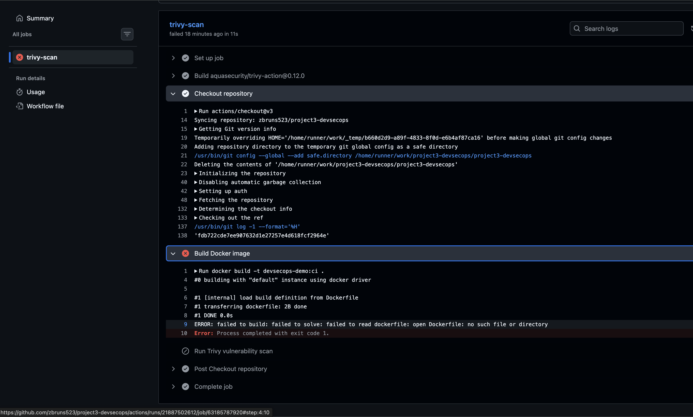
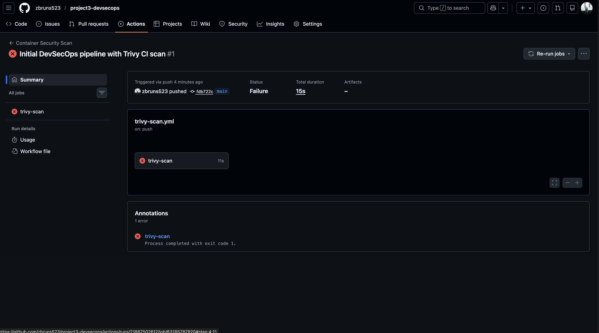

# Project 3 – DevSecOps Pipeline  
## Day 6: CI Container Security Scan (Trivy)

## Objective
Integrate automated container vulnerability scanning into the CI pipeline using **GitHub Actions** and **Trivy**. This day focuses on enforcing security checks during code changes and validating that vulnerabilities are detected and acted upon automatically during CI execution.

---

## CI Workflow Configuration

**Action:**  
Created a GitHub Actions workflow (`trivy-scan.yml`) to automatically run a Trivy container image scan on every push to the repository.

**Purpose:**  
Shift container security left by ensuring vulnerabilities are detected early in the development lifecycle and before deployment artifacts are promoted.

**Status:**  
GitHub Actions workflow is correctly configured and triggers on repository pushes.

### Screenshot

---

## Automated Trivy Scan Execution

**Action:**  
Triggered the CI pipeline by pushing code changes to the repository, causing the Trivy scan to execute automatically within GitHub Actions.

**Purpose:**  
Validate that the CI system correctly runs container security scans without manual intervention.

**Status:**  
Trivy scan executed successfully as part of the CI pipeline.

### Screenshot

---

## CI Security Gate Enforcement

**Action:**  
Observed Trivy detecting vulnerabilities and exiting with a non-zero status, causing the CI job to fail.

**Purpose:**  
Enforce security gates by preventing vulnerable container images from passing CI unchecked.

**Status:**  
Pipeline correctly fails when vulnerabilities are detected, demonstrating active security enforcement.

### Screenshot

---

## Security Notes

- Trivy is fully integrated into the CI pipeline
- Security scanning is enforced automatically on code changes
- CI job failure confirms vulnerabilities are treated as build blockers
- Demonstrates real-world DevSecOps security gate behavior

---

## Outcome

Day 6 confirms that the DevSecOps pipeline enforces **automated container vulnerability scanning** during CI execution. The pipeline successfully detects vulnerabilities and blocks insecure builds, validating a shift-left security approach and preparing the project for final hardening and production readiness in Day 7.